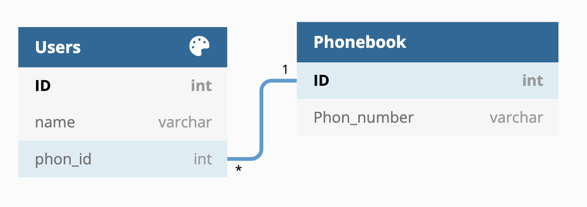

# Database
## - DB 사용 이유

데이터베이스가 존재하기 이전에는 파일 시스템을 사용하여 데이터를 관리했었다. 데이터를 각 파일 단위로 저장해서 업무를 처리하기 위한 Application과 상호 연동이 되어야 하는데, 이러한 파일 시스템으로 저장하면 **종속성** 문제 혹은
**데이터 무결성** 문제가 발생하게 된다.

간단히 말해서, 파일 시스템에서는 파일에 접근하는 방식이 Application 내에 표현되므로 Application과 데이터 간의 의존 관계가 존재하게 되어 데이터 구조, 접근 방법이 변경되면 기존의 프로그램과 데이터를 함께 변경해야 한다.

DB는 이러한 문제를 해결하기 위해 도입되었다.

---
## - DBMS

DBMS란 Database Management System의 줄임말로, 데이터베이스를 관리해주는 소프트웨어를 지칭한다.

DBMS는 1960년대의 계층형 DB를 사용하는 HDBMS인 IMS가 최초로 출시된 이래, 네트워크형, 관계형, 객체형 등으로 발전을 거듭해오고 있다. 현재는 관계형 DBMS(RDBMS)가 주류를 이루고 있으며, 대표적으로는 Oracle, MySQL, PostgreSQL, Microsoft SQL Server 등이 있다.

---
## - RDB

앞서 간단히 언급한 관계형 DB를 RDB라 지칭한다.

RDB는 테이블, 행, 열의 정보를 구조화하는 방식이다. 테이블을 조인하여 정보 간 관계 또는 링크를 설정할 수 있는 기능이 있어, 여러 데이터 포인트 간의 관계를 쉽게 이해하고 정보를 얻을 수 있다.

---
## - RDBMS

간단하게, RDBMS는 DBMS 중 앞서 언급한 RDB를 생성하고 수정할 수 있는 소프트웨어이다. 현재 주를 이루고 있는 DBMS이며 MySQL이 이에 해당한다.

---
## - DB 용어

1. Index - 데이터 레코드에 빠르게 접근하기 위해 <키 값, 주소> 쌍으로 구성된 데이터 구조
           데이터가 저장된 물리적 구조와 밀접한 관계를 가지고 있으며, Index를 통해 테이블의 레코드에 대해 빠르게 엑세스 할 수 있다.

2. Table - 행과 열로 구성된 데이터 집합
3. Row - 관계된 데이터의 묶음
4. Column - 가장 작은 데이터 단위를 의미하며, Field 또는 Attribute라고도 불린다.
5. Entity - 현실 세계에 존재하는 객체를 DB 상에 표현하기 위해 사용하는 추상적인 개념
6. Key

   슈퍼 키(Super Key) - 테이블의 행을 고유하게 식별할 수 있는 속성 또는 속성의 집합

   복합 키(Composite Key) - 2개 이상의 Attribute를 사용한 Key

   후보 키(Candidate Key) - 유일성과 최소성을 만족하는 Key

   기본 키(Primary Key) - 후보 키에서 선택된 Key

   대체 키(Surrogate Key) - 후보 키에서 선택되지 않은 Key

   외래 키(Foreign Key) - 서로 다른 테이블 간의 관계를 맺어주는 Key

7. Schema - 데이터베이스를 구성하는 데이터 객체, 속성, 레코드 간의 관계 등 데이터베이스의 골격 구조를 나타내는 일종의 도면으로, 데이터베이스의 Entity와 그 Entity들 간의 관계를 정의하고 어떠한 타입의 데이터가 어느 위치에 적재되어야 하는지, 또 다른 테이블이나 Entity와 어떠한 관계를 맺는지 등을 정의한다.

---
## - 유일성과 최소성

- 유일성 : 하나의 키 값으로 튜플을 유일하게 식별할 수 있는 성질. 예를 들어, 대학생들의 데이터를 관리할 때, 동명이인은 있으나 학번은 유일하다. 때문에 학번은 유일성을 만족하는 키라고 할 수 있다.

- 최소성 : 키를 구성하는 속성들 중 꼭 필요한 최소한의 속성들로만 키를 구성하는 성질. 예를 들어, 대학생들의 데이터는 학번 만으로 학생 한 명을 특정지을 수 있다. 이때 학번은 최소성을 만족하는 키라고 할 수 있다. 그러나 만약 이름 + 학번으로 구성된 테이블에서 동명이인이 없다면 이름 만으로도 학생을 특정할 수 있기 때문에 최소성을 만족하지 못한다.

## - DB 간의 관계

- 1:1 관계 - 하나의 레코드가 다른 레코드 한 개와 연결된 경우이다.

  

  phon_id는 외래 키로 Phonebook 테이블의 ID와 연결되어 있다. 이때 각 전화번호가 단 한 명의 유저와 연결되어 있고 그 반대도 동일하다면, Users 테이블과 Phonebook 테이블은 1:1 관계이다.

- 1:N 관계 - 하나의 레코드가 서로 다른 여러 개의 레코드와 연결된 경우이다.

  

  Users 테이블과 Phonebook 테이블의 관계가 다음과 같다면 이 구조에서 한 명의 유저가 여러 전화번호를 가질 수 있다. 단 여러 명의 유저가 하나의 전화번호를 가지는 것은 불가능하다. 현재 관계형 데이터베이스에서 가장 많이 사용된다.

- N:M 관계 - 여러 개의 레코드가 다른 테이블의 여러 개의 레코드와 관계가 있을 때 이를 N:M 관계라 한다.

  

  고객 한 명이 여러 개의 여행 상품을 가질 수 있고, 여행 상품 하나가 여러 명의 고객을 가질 수 있다. ID를 가지는 별도의 중계 테이블 customer_package를 만들어 다음 그림과 같이 구현이 가능하다.

## - ERD

ERD는 An Entity Relationship Diagram의 약자로 시스템의 Entity들이 무엇이 있는지, 어떤 관계를 맺고 있는지를 나타내기 위한 다이어그램이다. 관계형 DB에서 Entity와 Attribute들을 테이블과 Column으로 변환하여 테이블들과 관계를 시각화 할 수 있기 때문에 설계 문제점 파악에 유리하다.
