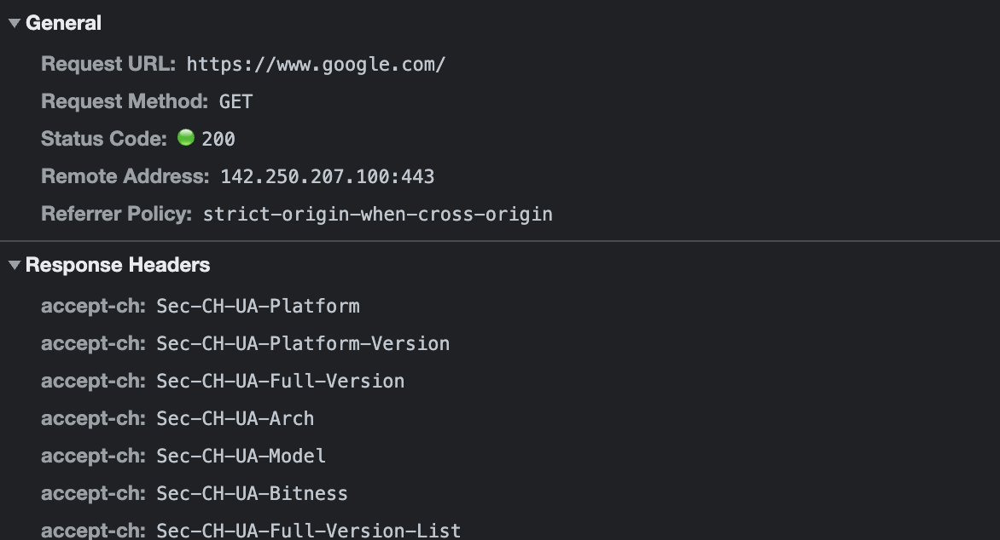
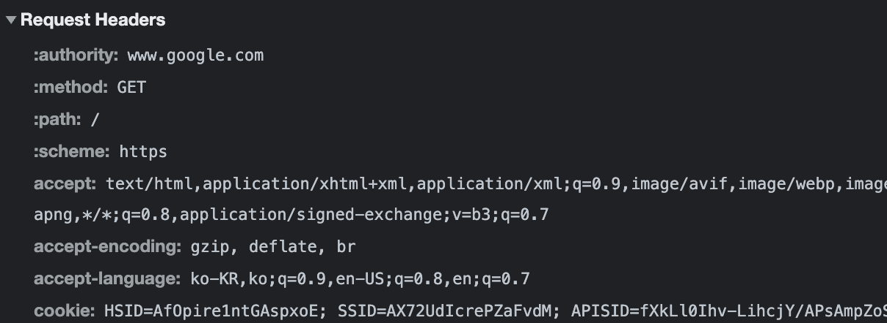

# 2. HTTP
 Hyper Text Transfer Protocol의 약자로 규칙이라고 볼 수 있는데 인터넷 상에서 데이터를 주고받을 수 있는 프로토콜입니다.

 위 그림은 구글에 접속했을 때 개발자 도구의 네트워크에 들어가서 HTTP Header를 확인한 사진입니다.

 Http message에는 두가지 타입이 있습니다. 하나는 Request(요청)이고 다른 하나는 Response(응답)입니다. Request는 클라이언트가 서버로 전달해 서버가 어떠한 동작을 하게끔 하고 Response는 Response에 대한 서버의 응답입니다.

 

## Http Request
Http Request는 start line, headers, body로 나눌 수 있습니다. 

start line에는 http method, request target(요청 대상 URL), http version을 명시합니다.

header에는 Host, User-agent, Accept 등 여러 정보들을 담고 있습니다. 아래에서 하나씩 자세히 알아보겠습니다.

마지막으로 body에는 전송하는 데이터를 담고있습니다. 만약 로그인 페이지에서 로그인을 시도하려면 user의 id와 pw등이 들어갈 것입니다.

**Request header의 정보**
- Host : 클라이언트가 요청하는 서버의 호스트 이름 또는 IP
- User-Agent : 클라이언트에서 사용중인 브라우저, 앱 또는 기타 클라이언트 소프트웨어에 대한 정보.
- Accept : 클라이언트가 서버에서 받아들일 수 있는 컨텐츠 유형. ex) text/html, application/json 등
- Accept-Language : 클라이언트가 선호하는 업어.
- Referer : 현재 요청된 페이지가 이전에 어떤 페이지를 통해 접근되었는지. 분석 등에 이용됨.
- Cookie : 클라이언트에 대한 쿠키정보.
- Authorization : 서버에 인증 정보를 제공하기 위해 사용.

 

## Http Response
Http response는 status line, header, body로 이루어져 있습니다.

status line에는 http버전과 status code, status text가 들어가있습니다.

header에는 Date, Server, Content-Type, Content-Length, Cache-Control 등이 들어가있습니다.

body는 response body와 일반적으로 동일합니다. 데이터를 전송할 필요가 없을 경우 body는 빌 수 있습니다.

**Response header의 정보**
- Content-Type : 응답 데이터가 어떤 유형인지 나타내고 요청과 마찬가지로 text/html, application/json 등으로 나타남.
- Content-Length : body의 길이를 나타냅니다. 클라이언트가 응답 데이터를 올바르게 수신하는데 도움이 됩니다.
- Server : 응답을 생성한 서버의 소프트웨어에 대한 정보를 보여줌.
- Set-Cookie : 서버에서 클라이언트에게 보낼 새로운 쿠리를 나타냄.
- Connection : 현재 연결 상태 (keep-alive / close)
- Cache-Control : 캐시 동작 지정. 캐싱, 캐시 유효기간, 캐시 제어, 제한 설정 가능.

 

## HTTP Method
클라이언트가 서버에게 요청하는 정보를 어떤 방식으로 다룰지 지정하는 방법입니다. 가장 일반적인 메서드는 GET, POST 입니다.

- GET : 지정된 리소스를 가져올 때 사용됩니다. 서버로부터 정보를 요청하기 위해 사용되고 요청한 메서드는 응답에 담겨 돌아옵니다.

- POST : 주로 새로운 리소스를 생성할 때 사용.

- PUT : 리소스를 생성/ 업데이트할 때 사용.

- DELETE : 리소스를 삭제하기 위해 사용됩니다.

 

## HTTP Status code
찾을 수 없는 페이지에 접근했을 때 404 Not Found 코드를 본 기억이 다들 있을것입니다. status code는 3자리 숫자로 이루어져있으며 100번대부터 500번대까지 있습니다.

- 1XX (Information responses) : 서버가 요청을 받았으며 서버에 연결된 클라이언트는 작업을 계속 진행하라는 의미입니다. HTTP 1.0에서는 지원하지 않습니다.

- 2XX (Successful responses) : 요청이 성공적으로 처리되었음을 알립니다.

- 3XX (Redirection messages) : 요청을 완료하기 위해 추가 동작이 필요함을 알립니다.

- 4XX (Client error responses) : 요청이 잘못되었거나 요청을 처리할 수 없다는 의미입니다.

- 5XX (Server error responses) : 서버의 처리과정에서 문제가 생겼음을 의미합니다.

