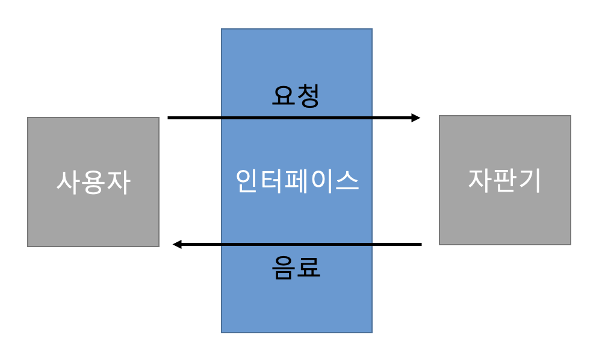

# 3. API

## API란?
API는 Application Programming Interface의 약자로 두 소프트웨어 구성요소가 서로 통신할 수 있게하는 인터페이스입니다.

한 줄로 정리해보면 서로 다른 소프트웨어 및 컴퓨터 사이의 데이터를 주고 받기 위한 방법이라고 할 수 있습니다.

> ### 인터페이스
> 조금 더 쉽게 설명하기 위해 인터페이스라는 개념부터 알아보겠습니다. 인터페이스는 서로 다른 두 시스템사이에서 정보나 신호를 주고받는 경우의 경계면입니다.
> 
> 우리가 자판기에서 음료수를 구매할 때 기계 내부의 작동원리를 몰라도 자판기의 버튼, 음료수 모형 등을 통해 쉽게 돈을 넣고 음료를 받을 수 있습니다. 이 때 우리가 보고있는 자판기의 앞부분을 인터페이스라고 할 수 있습니다.

다시 API로 돌아와 API는 마찬가지로 Interface입니다. 어떠한 소프트웨어나 컴퓨터가 또 다른 컴퓨터에게 동작원리를 알지 못해도 API를 요청을 하면 원하는 응답을 API를 통해 얻을 수 있습니다.

 

## REST API(Restful API)
Representational State Transfer의 약자로 아키텍쳐 스타일입니다.

---

6개의 제약조건/특징이 있습니다.
1. Client-server mandate : REST 서버는 API를 제공하고 클라이언트는 사용자 인증이나 컨텍스트 등을 직접 관리하는 구조로 역할이 확실히 구분됩니다. 이렇기에 각자 개발해야할 내용이 명확해지고 서로간 의존성이 줄어들게 됩니다.
2. Stateless : 상태정보를 따로 저장하고 관리하지 않습니다. 세션, 쿠키정보를 별도로 저장하기 않기 때문에 API서버는 들어오는 요청만을 처리하면 됩니다. 서비스의 자유도가 높아지고 서버에서 불필요한 정보를 관리하지 않습니다.
3. Cacheable : HTTP 웹표준을 그대로 사용해 웹에서 사용하는 기존 인프라를 그대로 활용할 수 있습니다. 따라서 HTTP가 가진 캐싱 기능이 적용가능합니다.
4. uniform contract : URL로 지정한 리소스에 대한 조작을 통일되고 한정적인 인터페이스로 수행하는 아키텍쳐입니다.
5. Layered system : 다중 계층으로 구성될 수 있으며 보안, 로드 밸런싱, 암호화 계층을 추가해 구조상의 유연성을 둘 수 있고 프록시, 게이트웨이 같은 네트워크 기반의 중간매체를 사용할 수 있습니다.
6. Self-descriptiveness : REST API 메시지만 보고 이를 쉽게 이해할 수 있습니다.

---

## REST API 디자인
REST api는 자원, 행위, 표현의 구성으로 이루어져있습니다.

1. URI(자원)은 정보의 자원을 표기해야합니다.(리소스명은 동사보다 명사를 사용합니다.)

    `POST /members/signup`

2. 자원에 대한 행위는 HTTP Method로 표현합니다. (GET, POST, PUT. DELETE 등)

3. '/'는  계층 관계를 나타내는데 사용합니다.

4. '-'은 URI의 가독성을 높이는데 사용합니다.

5. URI경로는 소문자를 사용합니다.

6. 확장자명은 URI에 포함하지 않습니다.

7. 리소스 간 관계는 아래와 같이 표현합니다.

    `/users/{userid}/likes/shops`

 
 

---
### 참고자료
https://www.bmc.com/blogs/rest-vs-crud-whats-the-difference/

https://meetup.nhncloud.com/posts/92