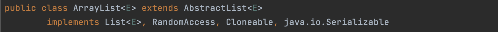

# OOP
데이터를 추상화 시켜 객체로 만들고 객체들간의 상호작용을 통해 로직을 구성하는 방법.

## 객체
객체는 프로그램에서 사용되는 데이터 또는 식별자에 의해 잠조되는 공간을 의미.

```java
public class User {
	Long user_idx;
	String email;
	String nickname;
	String password;
	LocalDateTime createdAt;
	LocalDateTime updatedAt;
}
```

위와 같이 User.class에서 객체를 정의하는 틀을 만들었습니다.

Main.class에서 user1 이라는 인스턴스를 생성하여 값들 대입하여 사용할 수 있습니다.

```java
public class Main {
	public static void main(String[] args) {
		User user1 = new User();
		user1.user_idx = 1L;
		user1.nickname = "dan";
		user1.password = "qwer1234";
		user1.createdAt = LocalDateTime.now();
		user1.updatedAt = LocalDateTime.now();
	}
}
```

## OOP의 특징

### 상속

부모클래스의 속성과 기능을 자식클래스에서 그대로 이어받을 수 있고 자식클래스에서 기능의 일부분을 변경하거나 그대로 사용할 수 있음.

```java
public class Board {
	Long board_idx;
	String contents;
	String title;
	User writer;
	LocalDateTime createdAt;
	LocalDateTime updatedAt;
}
```

위의 Board.class와 User.class를 보면 creatdAt, updatedAt이 겹치는 것을 알 수 있습니다. 아래와 같이 공통된 속성을 묶어서 하나의 클래스를 만들고 Board.class와 User.class는 그 클래스를 상속받게 하여 코드의 중복과 유지보수를 더 쉽게 할 수 있습니다.

```java
public class BaseEntity {
	LocalDateTime createdAt;
	LocalDateTime updatedAt;
}
```

```java
public class User extends BaseEntity {
	Long user_idx;
	String email;
	String nickname;
	String password;
}
```

```java
public class Board extends BaseEntity {
	Long board_idx;
	String contents;
	String title;
	User writer;
}
```

### 캡슐화
외부에 노출하지 않아야할 정보나 기능을 접근제어자를 통하여 숨겨주고 제어 권한이 있는 객체에서만 접근하도록 할수 있습니다.

```java
public class User extends BaseEntity {
	private Long user_idx;
	private String email;
	private String nickname;
	private String password;

	public User(Long user_idx, String email
				, String nickname, String password) {
		this.user_idx = user_idx;
		this.email = email;
		this.nickname = nickname;
		this.password = password;
	}

	public void changeNickname(String nickname) {
		this.nickname = nickname;
	}
}
```

위의 코드를 보면 필드들에 모두 private이라는 접근제어자가 붙어있어 외부에서 직접 수정을 하거나 볼 수 없습니다. 하지만 아래와 같이 생성자를 이용하여 user1의 필드를 선언하거나 메서드를 이용하여 nickname이라는 필드만 변경할 수 있습니다.

```java
public class Main {
	public static void main(String[] args) {
		User user1 = new User(1L, "ldc1104@naver.com", "dan", "qwer123");
		
		user.changeNickname("dongchan");
	}
}
```

### 다형성
국어사진을 검색해보면 어떤 형태나 형질이 다양하게 나타나는 현상이라고 정의되어있습니다.

프로그래밍에서 다형성은 업캐스팅, 다운캐스팅, 오버로딩, 오버라이딩 등과 같이 조상 클래스의 참조변수로 자손 클래스의 참조변수를 다루거나 같은 이름의 메서드여도 많은 형태의 메서드를 만드는 것 등에 주로 쓰입니다.

```java
public interface Repository {
	User save(User user);
	User findById(Long id);
	void delete(User user);
}

public class MySqlRepository implements Repository {
	User save(User user) {
		/* MySql 구현 내용*/
	}
	User findById(Long id) {
		/* MySql 구현 내용*/
	}
	void delete(User user) {
		/* MySql 구현 내용*/
	}
}

public class MariaRepository implements Repository {
	User save(User user) {
		/* MariaDB 구현 내용*/
	}
	User findById(Long id) {
		/* MariaDB 구현 내용*/
	}
	void delete(User user) {
		/* MariaDB 구현 내용*/
	}
}

public class H2Repository implements Repository {
	User save(User user) {
		/* H2 DB 구현 내용*/
	}
	User findById(Long id) {
		/* H2 DB 구현 내용*/
	}
	void delete(User user) {
		/* H2 DB 구현 내용*/
	}
}
```

위의 코드를 보면 Repository라는 인터페이스를 생성하고 각 데이터베이스의 Repository에는 인터페이스의 추상 메서드를 각각 자신의 데이터베이스에 맞게 구현을 해놓았습니다.

아래 코드에서는 인스턴스는 MySqlRepository를 생성하였지만 그 참조변수는 인터페이스인 것을 볼 수 있습니다. 이렇게 코드를 작성하면 만약 데이터베이스가 MySql에서 다른 데이터 베이스로 바꾸어도 인스턴스를 생성하는 부분만 변경하여 코드의 유지보수을 높일 수 있습니다.

```java
public class Main {
 public static void main(String[] args) {
		Repository repository = new MySqlRepository();
		
		User user1 = new User(1L, "ldc1104@naver.com",
							 "dan", "qwer123");
		
		repository.save(user1);
		repository.findById(1L);
		repostiroy.delete(user1);
	}
}
```




위 사진을 보면 ArrayList라는 클래스는 List라는 인터페이스를 구현한 것을 볼 수 있습니다. 그렇기에 아래와 같이 코드를 작성하면 코드의 유지보수성을 더 높일 수 있다는 것을 생각할 수 있습니다.

```java
	List<Integer> list = new ArrayList<Integer>();
```

객체를 생성할 때 객체의 타입은 인터페이스를 사용하는 것을 권장합니다.


### 추상화

- 제어 추상화
    사용자는 해당 메서드의 작동 방식, 내부 로직을 알 필요가 없습니다. ArrayList의 get이라는 메서드를 사용하여 리스트 안의 요소를 가져오려고 합니다. 우리는 `list.get(1)`과 같이 요소를 불러올 수 있을 것입니다. 하지만 우리는 ArrayList가 어떻게 get으로 요소를 불러오는지 모르며 메서드가 수정되더라도 우리는 코드를 수정할 필요가 없습니다.
- 데이터 추상화
    대상을 간단한 개념으로 일반화하는 과정입니다. 맥북을 생각해보면 맥북은 노트북에 포함이 되고 노트북은 컴퓨터에 포함이 되며 이것은 또 전자기기에 포함이 될 것입니다. 각각의 카테고리들의 특징을 정의하여 상속관계로 이어줄 수 있습니다.
    이렇게 공통 기능들을 미리 개발해놓으면 맥북 하나만 있을 때는 귀찮겠지만 핸드폰, 세탁기, LG그램 등 제품의 종류가 늘어남에 따라 빠르게 확장할 수 있을 것입니다.

