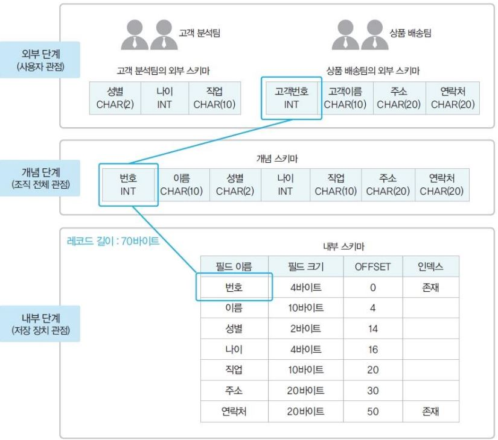
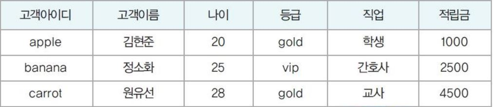

# DataBase

- ## DataBase 사용이유
데이터베이스를 제외한 데이터 보관 방법으로는 파일 시스템이 존재하는데 이 파일 시스템은 종속성과 중복성이라는 문제를 가진다. 
1. 데이터의 파일 구조가 변경된다면 응용프로그램도 변경해야한다.
2. 응용프로그램 별로 독립적인 파일 관리로 인해, 응용프로그램마다 독립된 파일을 가지므로 데이터를 중복 저장하는 문제가 생긴다. 

이런 문제점을 해결하기 위해 어느 한 조직의 여러 응용프로그램들이 공동으로 사용하는 데이터들을 통합하여 저장한 운영 데이터의 집합이 데이터 베이스이다.

 

- ## DBMS(DataBase Management System)
DataBase가 데이터 그 자체를 의미한다면, DBMS는 DataBase를 처리하는 컴퓨터 프로그램이다. 
 즉, **DataBase**를 사용하기 위해서는 DBMS를 사용해야한다. DBMS에는 대표적으로 MySQL, 오라클, MariaDB 등이 있다.  
 DBMS는 유형적으로 계층형, 망형, 관계형, 객체지향형 등으로 분류된다
 
  
 
 - ## RDB (관계형 DataBase)
 모든 데이터를 2차원의 단순한 표로 표현하는 형식의 데이터베이스  
 행렬과 비슷한구조로 행렬로 비유하면 행에는 Tuple이 열에는 Attribute가 온다. Attribut는 DataBase 테이블에서 하나의 컬럼에 대응한다.

 

- ## RDBS( 관계형 DataBase 관리 시스템)
위에서 나온 dbms들이 여기에 해당한다. 관계형 데이터 베이스를 만들고 업데이트하고 관리하는데 사용하는 프로그램이다.

 

- ## DB 용어 정리
1. 스키마(schema)  
데이터베이스에 저장되는 데이터 구조와 제약조건을 정의한 것
    - 외부 스키마 :외부 단계에서 사용자에게 필요한 데이터베이스를 정의한것
    - 개념 스키마 : 전체 데이터베이스에 어떤 데이터가 저장되는지, 데이터들 간에는 어떤 관계가 존재
    하고 어떤 제약조건이 있는지에 대한 정의뿐만 아니라, 데이터에 대한 보안 정책이나
    접근 권한에 대한 정의도 포함
    - 내부 스키마 :  레코드 구조, 필드 크기, 레코드 접근 경로 등 물리적 저장 구조를 정의
    - 
2. 인스턴스(instance)  
스키마에 따라 데이터베이스에 실제로 저장된 값
3. Table(릴레이션): 하나의 개체에 관한 데이터를 2차원 행렬 구조로 저장한 것
4. Column (attribute,속성): 테이블의 열
5. Tuple(tuple) : 릴레이션의 행
6. Key : 테이블에서 튜플들을 유일하게 구별하는 속성 또는 속성들의 집합  
Key의 특징
    - 유일성: 하나의 테이블에서 모든 튜플은 서로 다른 키 값을 가져야 함
    - 최소성: 꼭 필요한 최소한의 속성들로만 키를 구성

    Key의 종류
    
    - 슈퍼키: 유일성을 만족하는 컬럼 또는 컬럼들의 집합 ex) 고객아이디
    - 후보키: 유일성과 최소성을 만족하는 컬럼 또는 컬럼들의 집합
    - 기본키: 후보키 중에서 기본적으로 사용하기 위해 선택한 키
    - 대체키: 기본키로 선택되지 못한 후보키
    - 외래키: 다른 테이블의 기본키를 참조하는 컬럼 또는 컬럼들의 집합

 

- ## 유일성과 최소성
1. 유일성 
각각의 튜플들은 유일해야 한다.  
위에서 설명한 내용과 사진을 바탕으로 설명하면 고객이름,나이, 등급 등과 같은 컬럼들은 중복되어 유일하지 않은데 고객아이디는 중복될 수 없어 유일하다. 이런 특징이 유일성이다.
2. 최소성 
Key를 구성하는 속성들이 각 튜플을 구분하는데 꼭 필요한 속성들로만 구성되어 있는지에 관한 속성 즉, 최소성을 지킨다는 것은 꼭 필요한 최소한의 key를 사용한다는 것이다.

 

- ## DB간의 관계
개체와 개체가 맺고 있는 의미 있는 연관성 
개체 집합들 사이의 대응 관계, ==매핑 
1. 1:1  
참조하는 테이블의 튜플값과 참조되는 테이블의 튜블값이 단 하나의 관계를 가지는것을 의미. 
예를 들어 User라는 테이블과 Address라는 테이블이 존재할 때 user테이블의 튜플 하나에 address 테이블의 튜플 하나가 매칭된다.
2. 1:N 
 참조되는 테이블의 한 튜플과 참조하는 테이블의 여러 튜플이 매칭되는 관계
 여기서 참조되는 테이블의 튜플은 한개이다.
  
 예를들어, 유저 테이블과 리뷰 테이블이 존재한다고 하면 유저 하나당 여러 개의 리뷰에 매핑될 수 있으므로 1:N 관계라고 할 수 있다. 
 3. M:N 관계 
 관계를 가진 양쪽 테이블 모두에서 1:N 관계를 가지는 것을 의미한다. 이럴 경우 두 개의 테이블의 관계를 이어주는 제 3의 테이블이 별도로 필요하다.

  

 - ## ERD (Entity Relationship Diagram)
 ERD라는 용어를 살펴보면 객체 관리 다이어그램이다.  여기서 개체란, 쉽게 말해 table이라고 말할 수 있다. 즉 ERD는 용어로 설명하면 개체와 개체간의 1:1, 1:N, M:N 관계를 관계도로 표현한 것이다. 
 개체 안에 여러 Attribute 들을 적고 서로간의 관계를 시각화하여 표현하면 ERD가 된다.

