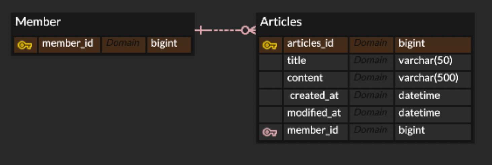
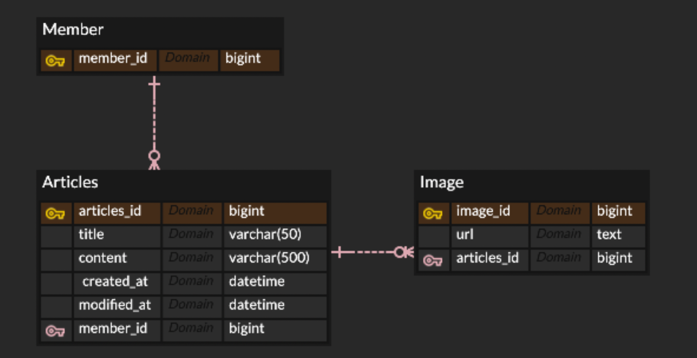

# 8주차 과제

게시판 기능 구현하기.

- 게시판 기능
  
  - 게시글 저장
  
  - 게시글 조회
    
    - 게시글 단일 조회
    
    - 게시글 전체 조회 (페이징 처리할 수 있으면 해보기)
  
  - 게시글 수정
  
  - 게시글 삭제

---

## 기본

게시글 작성자, 작성일시, 수정일시, id, 내용, 제목 등을 컬럼으로 가지는 게시글 엔티티가 저장, 조회, 수정, 삭제되는 기능을 구현한다.

**ERD 예시**

---

## 심화

기본에 추가로 게시글 이미지를 첨부할 수 있는 기능을 구현한다.

**ERD 예시**

